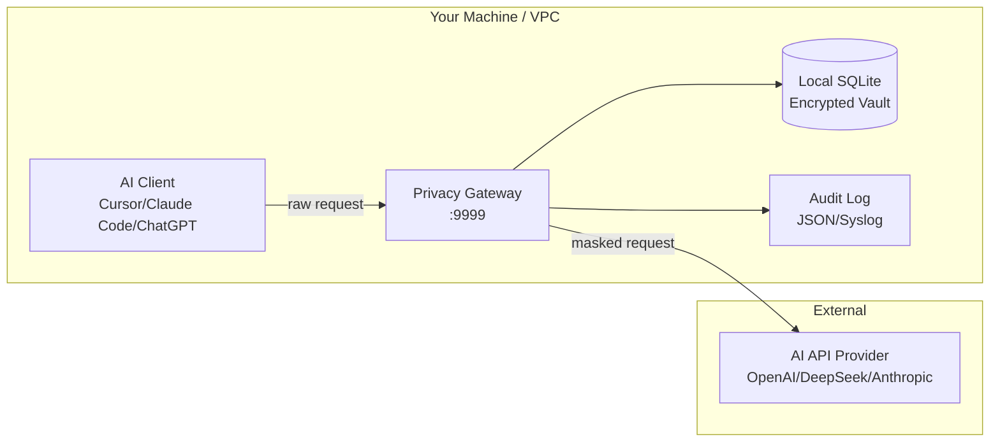

# AI Privacy Gateway

> Open-source PII masking proxy for ChatGPT, Claude, Cursor, DeepSeek, and any LLM API.
> Install a firewall for your AI data in 30 seconds. [MIT Licensed]

**v1.1.0** — A high-performance reverse proxy that automatically detects and masks sensitive data (phone numbers, ID cards, emails, bank cards, names, locations, API keys, and 14+ entity types) in AI API requests and responses. Protects PII before it leaves your machine.

<p align="center">
  <a href="https://privacygw.pages.dev"><strong>Website</strong></a> ·
  <a href="https://privacygw.pages.dev/demo"><strong>Online Demo</strong></a> ·
  <a href="https://privacygw.pages.dev/docs"><strong>Documentation</strong></a> ·
  <a href="https://github.com/gunxueqiu6/ai-privacy-gateway/releases"><strong>Releases</strong></a>
</p>

<p align="center">
  
  
  
  
  
  
</p>

<p align="center">
  <a href="#quick-start">Quick Start</a> ·
  <a href="#why-ai-privacy-gateway">Why</a> ·
  <a href="#architecture">Architecture</a> ·
  <a href="#comparison">Comparison</a> ·
  <a href="#supported-entities">Entities</a> ·
  <a href="#deployment">Deployment</a>
</p>

---

## Why AI Privacy Gateway?

| Concern | Without Gateway | With Gateway |
|---------|----------------|--------------|
| **PII in prompts** | Phone numbers, emails, ID cards sent to AI APIs in plain text | Auto-detected and masked as `[PHONE_1]`, `[EMAIL_1]` before leaving your machine |
| **API key leaks** | Source code containing API keys sent to third-party servers | Keys detected and replaced with placeholders |
| **GDPR / HIPAA compliance** | PII transferred without safeguards | PHI masked before transmission; data minimization enforced |
| **Model training data** | Your data could be used for training | Masked data is anonymous; original PII never stored |
| **Latency impact** | N/A | Under 1ms average added latency |

**Zero configuration. No code changes. Works with any OpenAI-compatible API.**

[简体中文](README_CN.md) | [English](README.md)

---

## Quick Start

### Docker (3 commands)

```bash
docker pull ghcr.io/gunxueqiu6/ai-privacy-gateway:lite

docker run -d --name ai-privacy-gw -p 9999:9999 \
  ghcr.io/gunxueqiu6/ai-privacy-gateway:lite

# Point your AI client to http://localhost:9999 — done.
```

### One-Click Script

```bash
# Windows: double-click start.bat, or:
python start.py

# macOS / Linux:
./start.sh
```

The wizard auto-detects your environment, walks through AI provider selection, generates secure keys, and starts the gateway.

> Non-interactive mode for CI/CD: `python start.py --non-interactive`

### Python (pip install)

```bash
pip install -r requirements.txt
python main.py
```

Set your AI client's API endpoint to `http://localhost:9999`:

```python
from openai import OpenAI

client = OpenAI(
    base_url="http://localhost:9999/v1",
    api_key="your-api-key"
)
```

### Cursor / VS Code / Claude Code / Cody

Settings → API Key → Base URL → `http://localhost:9999`

Works transparently with any AI tool that supports custom API endpoints.

---

## Architecture



**Request Flow:**
1. Your AI client sends a prompt containing sensitive data
2. Gateway intercepts, detects 14+ entity types via regex engine (< 1ms)
3. PII replaced with typed placeholders: `[PHONE_abc123]`, `[EMAIL_xyz789]`
4. Masked request forwarded to target AI API — provider never sees raw PII
5. AI response returned; original values restored from encrypted vault if needed

---

## Comparison

| Feature | AI Privacy Gateway | LLM Guard | PasteGuard | Nightfall AI | Private AI |
|---------|:---:|:---:|:---:|:---:|:---:|
| **License** | MIT | MIT | MIT | Commercial | Commercial |
| **Deployment** | Docker / pip | pip | Browser Extension | Cloud API | SDK / Cloud |
| **Setup time** | 30s | 5 min | 1 min | 1 hour+ | 1 hour+ |
| **PII types** | 14+ | 10+ | 8+ | 30+ | 50+ |
| **Latency** | < 1ms | ~5ms | < 0.5ms | ~50ms | ~100ms |
| **Offline / on-prem** | Yes | Yes | Browser-only | No | Partial |
| **Audit logging** | Yes | Limited | No | Yes | Yes |
| **Streaming (SSE)** | Yes | No | N/A | No | No |
| **HTTPS MITM** | Yes | Yes (proxy) | Browser-only | API-based | API-based |
| **Cost** | Free | Free | Free | $$$$ | $$$ |

### When to choose AI Privacy Gateway

- You need **zero external dependencies** — fully local, no cloud services
- You need **streaming support** (SSE/real-time masking)
- You want **30-second Docker deployment** with no configuration
- You need **both transparent proxy AND API mask/restore endpoints**
- You're using AI coding tools (Cursor, Claude Code, Copilot) that send code to APIs

---

## Supported Entity Types

| Type | Pattern | Example |
|------|---------|---------|
| Phone | 1[3-9]\d{9} | 13812345678 |
| ID Card | 18 digits | 110101199001011234 |
| Email | Standard format | user@example.com |
| Bank Card | 16-19 digits (Luhn check) | 6222021234567890123 |
| Person Name | Chinese + English names | 张三 |
| Location | Cities, districts, provinces | 北京市海淀区 |
| Organization | Company names | 北京科技有限公司 |
| Plate Number | Chinese format | 京A12345 |
| IP Address | IPv4 / IPv6 | 192.168.1.100 |
| URL | HTTP/HTTPS | https://example.com |
| Date | Various formats | 2024年1月15日 |
| Amount | Currency values | ¥999.99 |
| Postcode | 6 digits | 100080 |
| API Key | 20+ known formats | sk-abc... / AKIA... / ghp_... |
| Custom | User-defined regex | Passport numbers, SSN, etc. |

---

## Deployment

### Docker Compose

```bash
docker-compose up -d
```

### Kubernetes (Sidecar)

```yaml
apiVersion: v1
kind: Pod
spec:
  containers:
    - name: app
      image: my-app
      env:
        - name: OPENAI_BASE_URL
          value: http://localhost:9999/v1
    - name: privacy-proxy
      image: ghcr.io/gunxueqiu6/ai-privacy-gateway:lite
      ports:
        - containerPort: 9999
```

### Systemd (Linux Server)

```ini
[Unit]
Description=AI Privacy Gateway
After=network.target

[Service]
Type=simple
User=privacygw
WorkingDirectory=/opt/privacy-gateway
ExecStart=/usr/bin/python3 main.py
Restart=always
RestartSec=5

[Install]
WantedBy=multi-user.target
```

### Windows Executable

Download `PrivacyGateway.exe` from [Releases](https://github.com/gunxueqiu6/ai-privacy-gateway/releases) and double-click to run.

### macOS Binary

Download from [Releases](https://github.com/gunxueqiu6/ai-privacy-gateway/releases), `chmod +x PrivacyGateway`, and run `./PrivacyGateway`.

---

## Configuration

| Variable | Default | Description |
|----------|---------|-------------|
| `TARGET_LLM` | https://api.openai.com | Target AI API endpoint |
| `LISTEN_PORT` | 9999 | Gateway listen port |
| `DB_PATH` | ./vault_data/privacy_vault.db | SQLite database path |
| `ADMIN_PASSWORD` | (auto-generated) | Admin dashboard password |
| `JWT_SECRET` | (auto-generated) | JWT signing secret |
| `VAULT_ENCRYPT_KEY` | (auto-generated) | Vault encryption key |

---

## Admin Dashboard

Open `http://localhost:9999` and login with your admin password to:

- View real-time interception statistics and trend charts
- Manage custom sensitive words (add, test, delete)
- Check system health and version information
- Browse supported entity types

---

## API

```bash
# Mask text
curl -X POST http://localhost:9999/api/mask \
  -H "Content-Type: application/json" \
  -d '{"text": "张三住在北京市，电话13812345678"}'

# Restore text
curl -X POST http://localhost:9999/api/restore \
  -H "Content-Type: application/json" \
  -d '{"text": "[PII_PER_00000001]住在[PII_LOC_00000001]，电话[PII_PHONE_00000001]", "mappings": {...}}'

# Batch mask
curl -X POST http://localhost:9999/api/mask/batch \
  -H "Content-Type: application/json" \
  -d '{"texts": ["text1", "text2", "text3"]}'
```

---

## Project Structure

```
ai-privacy-gateway/
├── config.py              # Configuration management
├── mask_engine.py         # Regex masking engine (14+ types)
├── ner_engine.py          # NER entity recognition
├── stream_buffer.py       # SSE streaming buffer
├── gateway_core.py        # HTTP proxy core
├── database.py            # SQLite encrypted vault
├── main.py                # FastAPI entry point
├── routers/               # Route modules
│   ├── proxy.py           # Core proxy routes
│   ├── api.py             # Mask/restore API
│   ├── admin.py           # Admin dashboard
│   └── auth.py            # Auth endpoints
├── static/                # Admin dashboard UI
├── tests/                 # Test suite
└── website-astro/         # Public website (Astro)
```

---

## Development

```bash
git clone https://github.com/gunxueqiu6/ai-privacy-gateway
cd ai-privacy-gateway
pip install -r requirements.txt

# Run tests
pytest tests/ -v

# Run server
python main.py
```

---

## License

MIT License. See [LICENSE](LICENSE) for details.

## Links

- [Website](https://privacygw.pages.dev)
- [Online Demo](https://privacygw.pages.dev/demo)
- [Documentation](https://privacygw.pages.dev/docs)
- [GitHub Issues](https://github.com/gunxueqiu6/ai-privacy-gateway/issues)
- [Changelog](https://github.com/gunxueqiu6/ai-privacy-gateway/releases)
