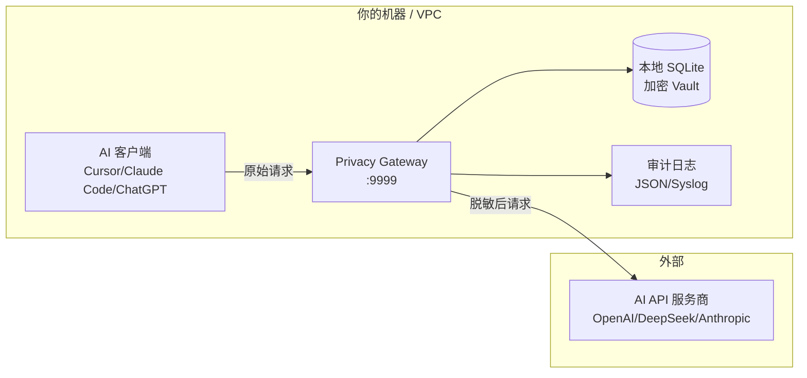

# AI Privacy Gateway

> 你的 AI 数据正在裸奔。30 秒装上防火墙。

**v2.0.0** — 开源 AI API 隐私网关。在数据离开你机器之前自动脱敏。v2.0 新增：AES-256-GCM Vault 加密、多上游负载均衡、发布/订阅审计总线、浏览器扩展 SDK、Windows/macOS 安装程序。

高性能反向代理，自动脱敏 AI API 请求/响应中的敏感数据（手机号、身份证、邮箱、银行卡、人名、地名等），支持所有 OpenAI 兼容服务，包括 DeepSeek、Claude、ChatGPT 和 Cursor。

<p align="center">
  <a href="https://privacygw.pages.dev"><strong>官网</strong></a> ·
  <a href="https://privacygw.pages.dev/demo"><strong>在线演示</strong></a> ·
  <a href="https://privacygw.pages.dev/docs"><strong>文档</strong></a> ·
  <a href="https://github.com/gunxueqiu6/ai-privacy-gateway/releases"><strong>下载</strong></a>
</p>

<p align="center">
  
  
  
  
  
  
</p>

[English](README.md) | [简体中文](README_CN.md)

---

## 为什么需要 AI Privacy Gateway？

| 场景 | 不用网关 | 用网关 |
|------|---------|--------|
| **提示词中的 PII** | 手机号、邮箱、身份证明文发送到 AI API | 自动检测并脱敏为 `[PHONE_1]`、`[EMAIL_1]` |
| **API 密钥泄露** | 含密钥的源代码发给第三方服务器 | 自动检测替换为占位符 |
| **GDPR / 个人信息保护** | 未经保护传输个人信息 | 传输前脱敏，落实数据最小化 |
| **模型训练数据** | 你的数据可能被用于训练 | 脱敏后数据匿名，原始 PII 不离开本地 |
| **延迟影响** | N/A | 平均增加不到 1ms |

**零配置。无需改代码。兼容所有 OpenAI 兼容 API。**

---

## 快速开始

### Docker（三条命令）

```bash
docker pull ghcr.io/gunxueqiu6/ai-privacy-gateway:lite

docker run -d --name ai-privacy-gw -p 9999:9999 \
  ghcr.io/gunxueqiu6/ai-privacy-gateway:lite

# AI 客户端 API 地址设为 http://localhost:9999 — 完成。
```

### 一键启动（新手从这里开始）

```bash
# Windows: 双击 start.bat，或：
python start.py

# macOS / Linux:
./start.sh
```

启动向导自动检测环境、引导选择 AI 服务商、生成安全密钥、启动网关。

> 非交互模式（CI/CD 用）：`python start.py --non-interactive`

### Python（pip 安装）

```bash
pip install -r requirements.txt
python main.py
```

将 AI 客户端 API 地址改为 `http://localhost:9999`：

```python
from openai import OpenAI

client = OpenAI(
    base_url="http://localhost:9999/v1",
    api_key="your-api-key"
)
```

### Cursor / VS Code / Claude Code / Cody

设置 → API Key → Base URL → `http://localhost:9999`

透明代理，支持所有自定义 API 端点的 AI 工具。

---

## 架构



**请求流程：**
1. AI 客户端发送包含敏感数据的请求
2. 网关拦截，正则引擎检测 14+ 类实体（< 1ms）
3. PII 替换为类型化占位符：`[PHONE_abc123]`、`[EMAIL_xyz789]`
4. 脱敏后请求转发目标 AI API — 服务商永远看不到原始 PII
5. AI 响应返回；如需还原，从加密 Vault 恢复原始值

---

## 竞品对比

| 特性 | AI Privacy Gateway | LLM Guard | PasteGuard | Nightfall AI | Private AI |
|------|:---:|:---:|:---:|:---:|:---:|
| **许可证** | MIT | MIT | MIT | 商业 | 商业 |
| **部署方式** | Docker / pip | pip | 浏览器扩展 | 云端 API | SDK / 云 |
| **部署时间** | 30 秒 | 5 分钟 | 1 分钟 | 1 小时+ | 1 小时+ |
| **PII 类型** | 14+ | 10+ | 8+ | 30+ | 50+ |
| **延迟** | < 1ms | ~5ms | < 0.5ms | ~50ms | ~100ms |
| **离线/本地部署** | 是 | 是 | 仅浏览器 | 否 | 部分 |
| **审计日志** | 是 | 有限 | 否 | 是 | 是 |
| **流式 (SSE)** | 是 | 否 | N/A | 否 | 否 |
| **HTTPS MITM** | 是 | 是（代理） | 仅浏览器 | API 方式 | API 方式 |
| **费用** | 免费 | 免费 | 免费 | 贵 | 较贵 |

### 选 AI Privacy Gateway 的场景

- 需要**零外部依赖** — 完全本地运行，不依赖云服务
- 需要**流式支持**（SSE 实时脱敏）
- 想要 **30 秒 Docker 部署**，无需配置
- 需要**透明代理 + API 脱敏/还原** 双模式
- 使用 AI 编程工具（Cursor, Claude Code, Copilot）发送代码到 API

---

## 支持的实体类型

| 类型 | 模式 | 示例 |
|------|------|------|
| 手机号 | 1[3-9]\d{9} | 13812345678 |
| 身份证 | 18位 | 110101199001011234 |
| 邮箱 | 标准格式 | user@example.com |
| 银行卡 | 16-19位（Luhn 校验） | 6222021234567890123 |
| 姓名 | 中文 + 英文 | 张三 |
| 地名 | 省市区县 | 北京市海淀区 |
| 机构名 | 公司名称 | 北京科技有限公司 |
| 车牌号 | 中国车牌 | 京A12345 |
| IP 地址 | IPv4 / IPv6 | 192.168.1.100 |
| URL | HTTP/HTTPS | https://example.com |
| 日期 | 多种格式 | 2024年1月15日 |
| 金额 | 货币金额 | ¥999.99 |
| 邮编 | 6位数字 | 100080 |
| API 密钥 | 20+ 已知格式 | sk-abc... / AKIA... / ghp_... |
| 自定义 | 用户正则 | 护照号、SSN 等 |

---

## 部署

### Docker Compose

```bash
docker-compose up -d
```

### Kubernetes（Sidecar）

```yaml
apiVersion: v1
kind: Pod
spec:
  containers:
    - name: app
      image: my-app
      env:
        - name: OPENAI_BASE_URL
          value: http://localhost:9999/v1
    - name: privacy-proxy
      image: ghcr.io/gunxueqiu6/ai-privacy-gateway:lite
      ports:
        - containerPort: 9999
```

### Systemd（Linux 服务器）

```ini
[Unit]
Description=AI Privacy Gateway
After=network.target

[Service]
Type=simple
User=privacygw
WorkingDirectory=/opt/privacy-gateway
ExecStart=/usr/bin/python3 main.py
Restart=always
RestartSec=5

[Install]
WantedBy=multi-user.target
```

### Windows 可执行文件

从 [Releases](https://github.com/gunxueqiu6/ai-privacy-gateway/releases) 下载 `PrivacyGateway.exe`，双击运行。

### macOS 可执行文件

从 [Releases](https://github.com/gunxueqiu6/ai-privacy-gateway/releases) 下载，`chmod +x PrivacyGateway`，运行 `./PrivacyGateway`。

---

## 环境变量

| 变量 | 默认值 | 说明 |
|------|--------|------|
| `TARGET_LLM` | https://api.openai.com | 目标 AI API 地址 |
| `LISTEN_PORT` | 9999 | 网关监听端口 |
| `DB_PATH` | ./vault_data/privacy_vault.db | SQLite 数据库路径 |
| `ADMIN_PASSWORD` | （自动生成） | 管理后台密码 |
| `JWT_SECRET` | （自动生成） | JWT 签名密钥 |
| `VAULT_ENCRYPT_KEY` | （自动生成） | AES-256-GCM Vault 加密密钥 |
| `UPSTREAM_LLM_URLS` | （空） | 多上游 LLM 地址，逗号分隔，用于负载均衡 |
| `UPSTREAM_LB_STRATEGY` | round_robin | 负载均衡策略：round_robin、random、least_connections |
| `MAPPING_TTL` | 259200（72小时） | 映射条目 TTL 秒数（0 = 请求完成后即删除） |
| `STATELESS_MODE` | 0 | 设为 1 启用无状态模式（纯内存，不落盘） |

---

## 管理后台

打开 `http://localhost:9999`，用管理员密码登录后可以：

- 查看实时拦截统计与趋势图表
- 管理自定义敏感词（添加、测试、删除）
- 检查系统健康与版本信息
- 浏览支持的实体类型

---

## API 使用

```bash
# 脱敏
curl -X POST http://localhost:9999/api/mask \
  -H "Content-Type: application/json" \
  -d '{"text": "张三住在北京市，电话13812345678"}'

# 还原
curl -X POST http://localhost:9999/api/restore \
  -H "Content-Type: application/json" \
  -d '{"text": "[PII_PER_00000001]住在[PII_LOC_00000001]，电话[PII_PHONE_00000001]", "mappings": {...}}'

# 批量脱敏
curl -X POST http://localhost:9999/api/mask/batch \
  -H "Content-Type: application/json" \
  -d '{"texts": ["text1", "text2", "text3"]}'
```

---

## 项目结构

```
ai-privacy-gateway/
├── config.py              # 配置管理
├── mask_engine.py         # 正则脱敏引擎（14+ 类型）
├── ner_engine.py          # NER 实体识别
├── stream_buffer.py       # SSE 流式缓冲
├── gateway_core.py        # HTTP 代理核心
├── database.py            # SQLite 加密 Vault
├── main.py                # FastAPI 入口
├── routers/               # 路由模块
│   ├── proxy.py           # 核心代理路由
│   ├── api.py             # 脱敏/还原 API
│   ├── admin.py           # 管理后台
│   └── auth.py            # 认证
├── load_balancer.py       # 多上游负载均衡器
├── audit.py               # 发布/订阅审计事件总线
├── vault_crypto.py        # AES-256-GCM Vault 加密
├── static/                # 管理后台前端
├── sdk/                   # 客户端 SDK
│   ├── browser-extension/ # Chrome/Edge 浏览器扩展
│   ├── js/                # JavaScript/TypeScript SDK
│   └── flutter/           # Flutter/Dart SDK
├── tests/                 # 测试用例
└── website-astro/         # 官网 (Astro)
```

---

## 开发

```bash
git clone https://github.com/gunxueqiu6/ai-privacy-gateway
cd ai-privacy-gateway
pip install -r requirements.txt

# 运行测试
pytest tests/ -v

# 启动
python main.py
```

---

## License

MIT License。详见 [LICENSE](LICENSE)。

## 链接

- [官网](https://privacygw.pages.dev)
- [在线演示](https://privacygw.pages.dev/demo)
- [文档](https://privacygw.pages.dev/docs)
- [GitHub Issues](https://github.com/gunxueqiu6/ai-privacy-gateway/issues)
- [更新日志](https://github.com/gunxueqiu6/ai-privacy-gateway/releases)
