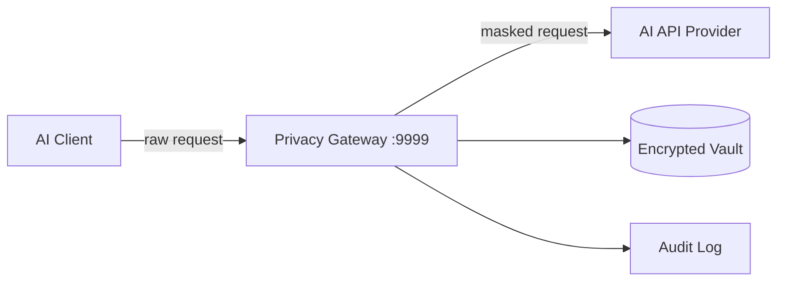

# Docker Hub + ProductHunt 推广内容

---

## Docker Hub 描述

> 在 Docker Hub 仓库 Description 中填入以下内容
> 仓库: ghcr.io/gunxueqiu6/ai-privacy-gateway (或 hub.docker.com)

### Short Description (100 chars)

```
Open-source PII firewall for AI APIs. Auto-mask sensitive data before it reaches ChatGPT, Claude, Cursor. 30s deploy.
```

### Full Description (Markdown)

```markdown
# AI Privacy Gateway

**PII firewall for LLM APIs — mask sensitive data before it leaves your machine.**

[](https://github.com/gunxueqiu6/ai-privacy-gateway)
[](https://github.com/gunxueqiu6/ai-privacy-gateway)
[](https://ghcr.io/gunxueqiu6/ai-privacy-gateway)

## Quick Start

```bash
docker pull ghcr.io/gunxueqiu6/ai-privacy-gateway:lite
docker run -d --name ai-privacy-gw -p 9999:9999 \
  ghcr.io/gunxueqiu6/ai-privacy-gateway:lite

# Point your AI client to http://localhost:9999 — done.
```

## What It Does

A transparent HTTP reverse proxy that sits between your AI tools and API providers. Before any data leaves your machine, it auto-detects and masks:

| Category | Example | Masked As |
|----------|---------|-----------|
| Phone | 13812345678 | [PHONE_1] |
| Email | user@example.com | [EMAIL_1] |
| ID Card | 110101199001011234 | [ID_1] |
| Bank Card | 6222021234567890123 | [BANK_CARD_1] |
| API Key | sk-proj-xxxxx | [API_KEY_1] |
| + 9 more types | names, locations, IPs, URLs... | |

## Architecture



## Why This Image?

- **30 seconds** — No config files, no API keys, no setup wizards
- **<1ms latency** — Regex engine compiled at startup, single-pass scan
- **SSE streaming** — Real-time chat masking with sliding-window buffer
- **Zero dependencies** — No external services, no telemetry, fully offline
- **14+ entity types** — Phones, emails, IDs, bank cards, API keys, names, locations...
- **MIT license** — Free for personal and commercial use

## Works With

ChatGPT, Claude, Cursor, DeepSeek, GitHub Copilot, VS Code, and any OpenAI-compatible API.

## Comparison

| Feature | AI Privacy Gateway | LLM Guard | Nightfall |
|---------|:---:|:---:|:---:|
| License | MIT | MIT | Commercial |
| Deploy | Docker 30s | pip 5min | Cloud setup |
| Latency | <1ms | ~5ms | ~50ms |
| Offline | Yes | Yes | No |
| Streaming | Yes | No | No |
| Cost | Free | Free | $$$ |

## Environment Variables

| Variable | Default | Description |
|----------|---------|-------------|
| TARGET_LLM | https://api.openai.com | Target AI API |
| LISTEN_PORT | 9999 | Gateway port |
| DB_PATH | ./vault_data/privacy_vault.db | Encrypted vault path |

## Links

- [Website](https://privacygw.pages.dev)
- [Documentation](https://privacygw.pages.dev/docs)
- [Online Demo](https://privacygw.pages.dev/demo)
- [GitHub](https://github.com/gunxueqiu6/ai-privacy-gateway)
- [Enterprise Guide](https://privacygw.pages.dev/enterprise-ai-data-protection)
```

### Docker Hub Tags

```bash
# Tag strategy
docker tag ghcr.io/gunxueqiu6/ai-privacy-gateway:lite ghcr.io/gunxueqiu6/ai-privacy-gateway:latest
docker tag ghcr.io/gunxueqiu6/ai-privacy-gateway:lite ghcr.io/gunxueqiu6/ai-privacy-gateway:v1.1.0

# Push all tags
docker push ghcr.io/gunxueqiu6/ai-privacy-gateway:lite
docker push ghcr.io/gunxueqiu6/ai-privacy-gateway:latest
docker push ghcr.io/gunxueqiu6/ai-privacy-gateway:v1.1.0
```

### Add to Awesome Lists

提交 PR 到以下 awesome list：
- https://github.com/awesome-selfhosted/awesome-selfhosted — `# Self-hosted AI / Privacy`
- https://github.com/veggiemonk/awesome-docker — `# Security`
- 搜索 `awesome-llm-security` `awesome-ai-privacy` 等项目并提交

---

## ProductHunt 发布

> 等 HN Show HN + Reddit 有 traction 后再发 ProductHunt
> 发布时间：周二 PST 12:01am（PH 按天排行）

### Listing Info

**Product Name:** AI Privacy Gateway

**Tagline:** Open-source PII firewall for AI APIs — 30s deploy, zero config

**URL:** https://privacygw.pages.dev

**GitHub:** https://github.com/gunxueqiu6/ai-privacy-gateway

**Categories:** Developer Tools, Security, Open Source

**Pricing:** Free (MIT Open Source)

### Description

```
AI Privacy Gateway is a self-hosted proxy that automatically masks 
sensitive data (phone numbers, emails, ID cards, API keys, and 14+ 
entity types) from your AI API calls before they leave your machine.

🔒 What it protects:
- PII in prompts (phones, emails, names, IDs)
- API keys and secrets in source code sent to coding AIs
- Healthcare data (PHI) for HIPAA compliance
- Financial data for PCI DSS / SOC 2 compliance
- Enterprise data under GDPR / PIPL

⚡ Key features:
- 30-second Docker deploy
- <1ms latency (regex engine, compiled at startup)
- SSE streaming support (real-time chat masking)
- Works with ChatGPT, Claude, Cursor, DeepSeek, Copilot
- Fully local — no external services, no telemetry
- MIT licensed

🆚 vs alternatives:
- vs LLM Guard: proxy (not SDK), SSE streaming, lower latency
- vs Nightfall/Private AI: free & local (not cloud & enterprise $$)
- vs PasteGuard: covers APIs & IDEs (not just browser)

Built by a developer who kept pasting customer data into ChatGPT 
and couldn't find a single-command, zero-config, fully-local fix.
```

### Maker Comment (发布后立即评论)

```
Hey ProductHunt! 👋

I built AI Privacy Gateway because I was pasting customer data into 
ChatGPT daily and couldn't find a simple, zero-config, fully-local 
fix. Everything was either a SaaS with per-seat pricing, a Python 
library that needed code changes, or a browser extension that only 
worked on chat.openai.com.

The goal was dead simple: a proxy that strips PII from AI API traffic 
before it leaves your network. No SaaS dependencies. No "sign up for 
enterprise." Just docker run and forget it.

Key design decisions:
1. Regex, not ML — <1ms latency for real-time AI chat (ML adds 50-100ms)
2. Proxy, not SDK — works with any AI tool without code changes
3. Local, not cloud — your data never touches a third party

3 months of building. MIT licensed. Hope it helps someone.

Happy to answer any questions!

Tech stack: Python + FastAPI, SQLite vault, compiled regex engine
GitHub: https://github.com/gunxueqiu6/ai-privacy-gateway
```

### ProductHunt 图片

准备 5 张截图/GIF：

1. **Hero 图** (1200×630): Logo + "PII Firewall for AI APIs" + Docker command
2. **架构图**: 数据流图（Client → Proxy → API）
3. **Demo GIF**: 在线演示的实时脱敏效果
4. **Dashboard**: 管理后台的拦截统计
5. **Comparison**: vs 竞品的对比表

### Launch Day Checklist

- [ ] 提前 2 周预约 PH launch
- [ ] 联系 5-10 个支持者，在第一个小时内 upvote
- [ ] 准备 Maker Comment（提前写好，发布后立刻评论）
- [ ] 在 Twitter/Reddit/HN 同步分享 PH 链接
- [ ] 发布后每 30 分钟检查一次评论，及时回复
- [ ] 发布 24 小时后发感谢推文
